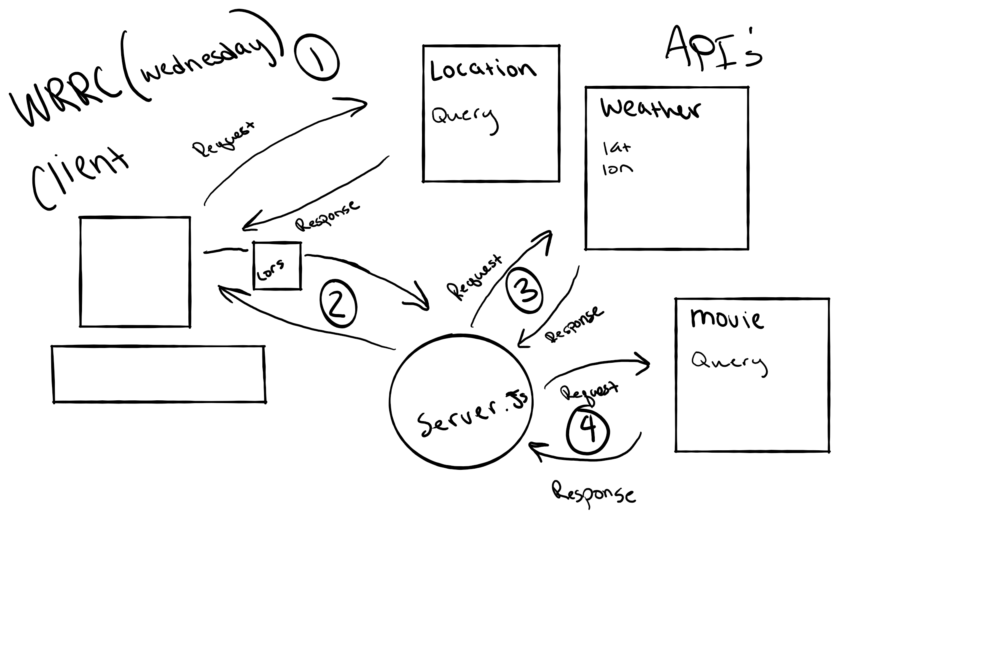
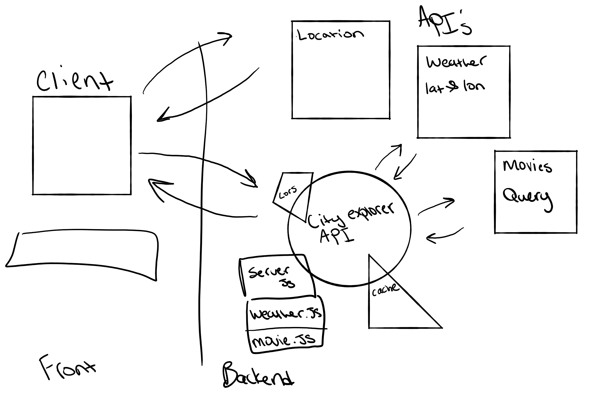

# City explorer API

**Author**: Tanner P
**Version**: 1.0.0 

## Overview
API used for handling endpoints for city planner -> parsing data on server side and sending it to front end to apease the request (get)

## Getting Started
git clone repo
cd repo
npm i
npm start

## Architecture

![ScreenShot](./data/images/WRRCLAB09-TANNER-REY.png..

## User Stories

- Given that a user enters a valid location in the input When the user clicks the "Explore!" button Then some old weather data will be displayed on the page

## Change Log

- 1.0: adds scaffold

## Credit and Collaborations
