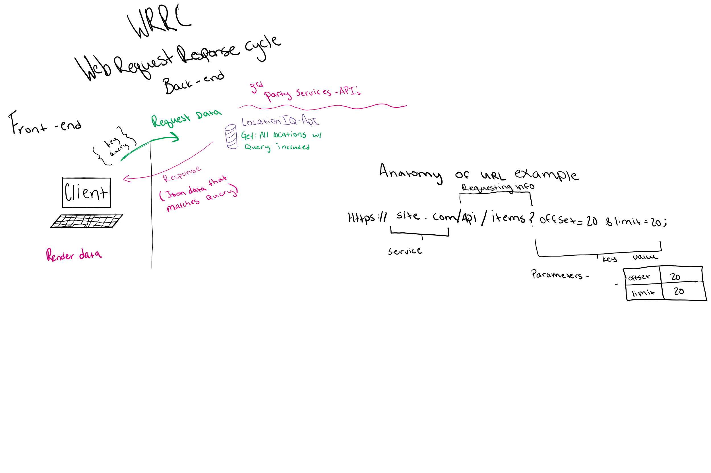
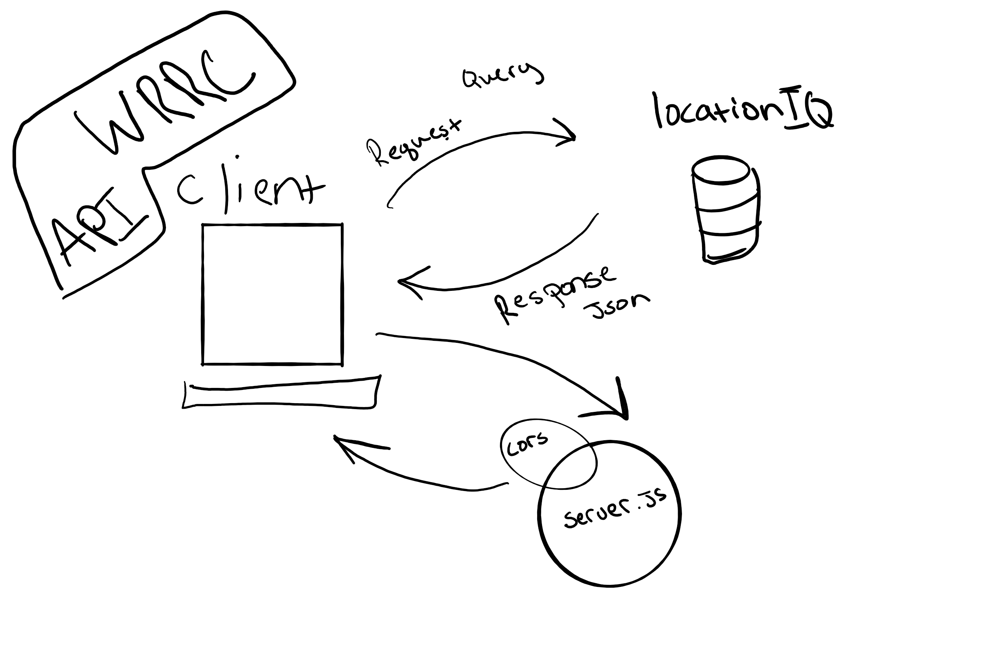

# City explorer API

**Author**: Tanner P
**Version**: 1.0.0 

## Overview
API used for handling endpoints for city planner -> parsing data on server side and sending it to front end to apease the request (get)

## Getting Started
git clone repo
cd repo
npm i
npm start

## Architecture

## User Stories

- Given that a user enters a valid location in the input When the user clicks the "Explore!" button Then some old weather data will be displayed on the page

## Change Log

- 1.0: adds scaffold
# feature list
Name of feature: Init

Estimate of time needed to complete: 30 min

Start time: 1:30

Finish time:2 

Actual time needed to complete:30 min

Name of feature: locations
Estimate of time needed to complete: 1 hr 
Start time: 4
Finish time:530
Actual time needed to complete:130
Name of feature: maps
Estimate of time needed to complete: 30 min
Start time: 530
Finish time:630
Actual time needed to complete:1hr
Name of feature: error
Estimate of time needed to complete: 1 hr
Start time: 7
Finish time:930
Actual time needed to complete:2 and a half hourss
Name of feature: weather (live)
Estimate of time needed to complete: 1 hr
Start time: 1:15
Finish time:2:15
Actual time needed to complete:1hr
Name of feature: Movies
Estimate of time needed to complete: 1 hr
Start time: 2:30
Finish time: 4:30
Actual time needed to complete:2 hr
Name of feature: deploy
Estimate of time needed to complete: 15 min
Start time: 5
Finish time: 6
Actual time needed to complete: 1 hour
Name of feature: Modularize3
Estimate of time needed to complete: 3 hr
Start time: 1:30 pm
Finish time:
Actual time needed to complete:
Name of feature: 
Estimate of time needed to complete: 
Start time: 
Finish time:
Actual time needed to complete:

## Credit and Collaborations
